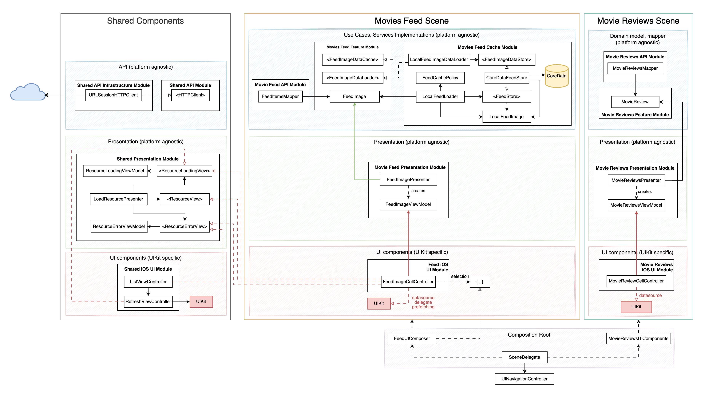
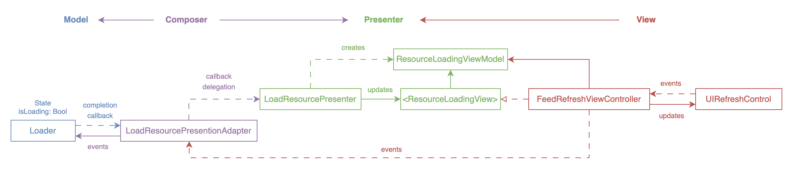

# AEFeed

> This project is intended to demonstrate effective iOS development techniques, with a concentration on TDD, clean architecture, reusability and maintainability.

## Getting Started
You need a [token](https://www.themoviedb.org/documentation/api) to use the app.

## Movies Feed Feature Requirements

Scenarios:

Option #1
As an online user, I want the app to automatically update the feed with the latest content. 
This ensures that I am always up to date with the latest images, providing a nice and smooth user experience.

Option #2
As an offline user, I want the app to display the latest saved version of the movie feed. 
This feature will allow me to view images even if I don't have an internet connection.

## Use Cases:

### Remote Case

|  | Feed Load | Image Load |
|---|---|---|
| Main Scenario (success) 1. Execute "Load" command with provided URL. 2. System downloads data from the URL. 3. System creates feed from valid data. 4. System delivers feed. | ✅ | ✅ |
| Invalid data (failure): 1. System delivers invalid data error. | ✅ | ✅ |
| No connectivity (failure): 1. System delivers connectivity error. | ✅ | ✅ |
| Cancel course: 1. System does not deliver image data nor error. | Not applied | ✅ |

### Local Case

|  | Feed Load | Image Load |
|---|---|---|
| Main Scenario (success): 1. Execute "Load" command. 2. System retrieves data from cache. 3. System validates cache against timestamp (only feed). 4. System creates and delivers items from cached data. | ✅ | ✅ |
| Retrieval error course (failure): 1. System delivers error. | ✅ | ✅ |
| Empty cache course:  1. System delivers no feed/image. | ✅ | ✅ |
| Expired cache course (failure):  1. System delivers no feed/image. | ✅ | Not applied |
| Cancel course: 1. System does not deliver image data nor error. | Not applied | ✅ |

### Cache Case

|  | Feed | Image |
|---|---|---|
| Main Scenario (success): 1. Execute "Save" command. 2. System deletes old cache data (only feed). 3. System encodes data (only feed). 4. System timestamps the new cache (only feed). 5. System saves new cache data. 6. System delivers success message. | ✅ | ✅ |
| Saving error course (failure): 1. System delivers error. | ✅ | ✅ |
| Deleting error course (failure): 1. System delivers error. | ✅ | Not applied |

## Movie Reviews Feature Specs

Option #1
As an online user, I want the app to load reviews of the movie. 
By reading the review, I can obtain valuable information about the movie.

|  | Feed |
|---|---|
| Main Scenario (success): 1. Execute "Load" command with provided URL. 2. System downloads data from the URL. 3. System creates feed from valid data. 4. System delivers feed. | ✅ |

## Dependency Diagram

## MVP UI design pattern implementation (loading state example)

